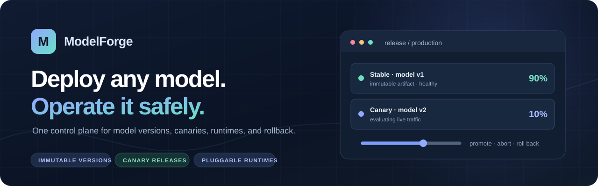
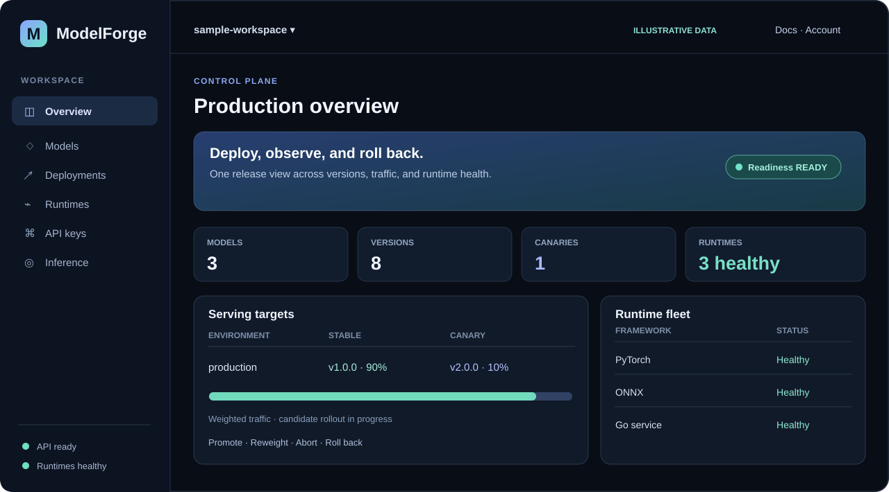
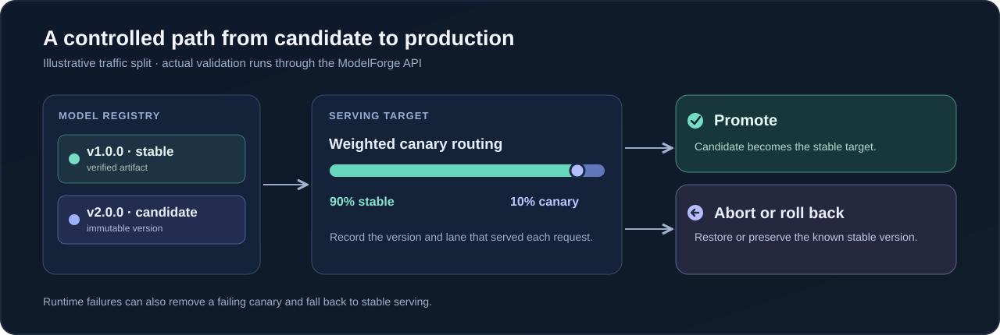
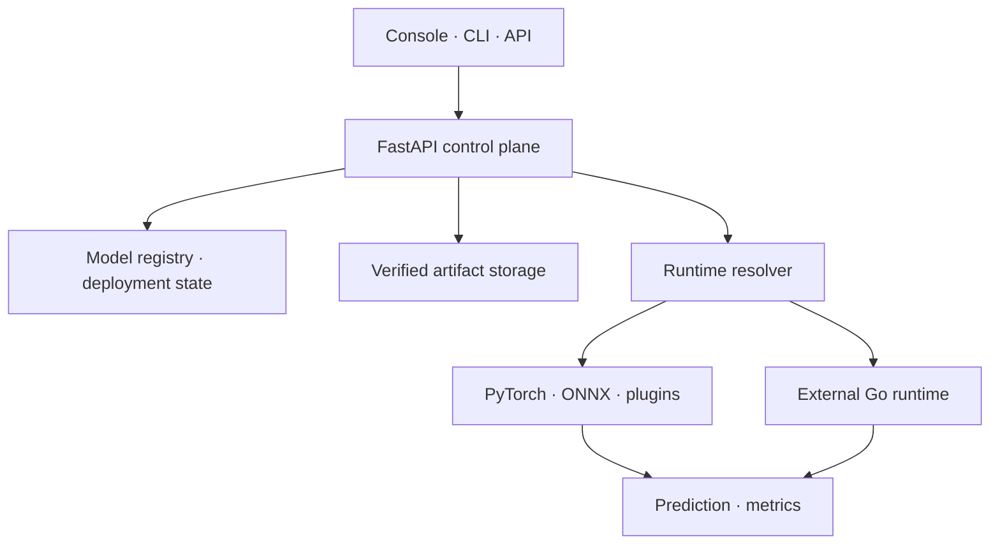

<p align="center">
  
</p>

<h1 align="center">ModelForge</h1>
<p align="center"><strong>Deploy any model. Operate it safely.</strong><br>
A model registry, deployment control plane, and inference platform built for<br>
versioned artifacts, progressive releases, and framework-independent execution.</p>

<p align="center">
  <a href="https://github.com/michaelbawuah/ModelForge/actions/workflows/ci.yml"></a>
  <a href="pyproject.toml"></a>
  <a href="runtimes/go-runtime/"></a>
</p>
<p align="center">
  <a href="#what-it-does">What it does</a> ·
  <a href="#product-preview">Product preview</a> ·
  <a href="#quick-start">Quick start</a> ·
  <a href="#architecture">Architecture</a> ·
  <a href="#documentation">Documentation</a>
</p>

---

## What it does

ModelForge gives teams one place to register models, publish immutable versions,
route inference traffic, and manage deployments. The same control plane serves
browser, CLI, and API workflows.

| Capability | In practice |
| --- | --- |
| **Version with confidence** | Publish immutable artifacts and verify their SHA-256 checksums before execution. |
| **Release progressively** | Send a weighted share of requests to a canary, then promote, abort, or roll back. |
| **Run across frameworks** | Use PyTorch, ONNX, the Go runtime, or an independently implemented runtime plugin. |
| **Contain failures** | Inspect health and metrics; use bounded retries, circuit breakers, and stable fallback. |
| **Separate workspaces** | Scope models, deployments, artifacts, and API keys to the authenticated workspace. |

## Product preview

The browser console surfaces model versions, serving targets, runtime health,
and release actions from the same API used by the CLI.



<sub>Illustrative console view based on the current interface, using example data. ModelForge is not publicly hosted yet.</sub>

### A release in one view

The stable model continues serving while a candidate receives a controlled
share of traffic. The scenario can promote the candidate or restore the stable
target after a rollback or failed canary.



The [deployment validation scenario](docs/demo-proof.md) exercises this flow
through real API requests and records the results as JSON and Markdown evidence.

## Quick start

Want to look around first? [View the illustrated product preview](#product-preview).
The application is not publicly hosted yet.

To run the **local development stack**, install Docker with Compose, then run:

```bash
git clone https://github.com/michaelbawuah/ModelForge.git
cd ModelForge
docker compose up --build --wait --detach
```

When the containers are healthy, open `http://localhost:8000/` (landing page)
or `http://localhost:8000/dashboard` (console) **on the same computer**.
These addresses only work while your local stack is running; they are not
links to an online instance.

To run the optional deployment scenario, install Python 3.11+ and the project
dependencies in a local environment, then run:

```bash
python3 -m venv .venv
source .venv/bin/activate
python -m pip install -e .
make proof
```

Inspect `demo-proof-evidence/proof-report.md` and stop the stack when finished:

```bash
docker compose down
```

The Compose configuration uses development defaults. Follow the
[cloud deployment contract](docs/cloud-deployment.md) for a hosted installation;
the AWS reference stack has **not** been launched for public use.

## Architecture



The control plane owns model identity, workspace boundaries, release state,
and traffic decisions. Runtimes own framework-specific model execution. New
frameworks can implement the [external runtime contract](docs/runtime-protocol.md)
without adding framework-specific branches to the serving path.

## Built with

| Control plane | Execution | Data and operations |
| --- | --- | --- |
| Python · FastAPI · SQLAlchemy | PyTorch · ONNX Runtime · Go | MySQL · Alembic · Prometheus |
| OIDC browser sessions · workspace API keys | Runtime plugin protocol · HTTP | Local/S3-compatible artifacts · Docker · Terraform |

CI runs Python and Go validation, Terraform checks, container builds, and a
Compose smoke test. Benchmark figures are documented in the
[engineering guide](docs/engineering-guide.md) with their CI hardware context;
they are not production capacity claims.

## Documentation

- [Platform overview](docs/platform-overview.md) — lifecycle, runtimes, and access model.
- [Engineering guide](docs/engineering-guide.md) — implementation details, commands, tests, and measurements.
- [Architecture and invariants](docs/architecture.md) — serving and failure boundaries.
- [Deployment validation](docs/demo-proof.md) — promotion, rollback, and regression checks.
- [Runtime protocol](docs/runtime-protocol.md) — add an external framework runtime.
- [AWS reference deployment](infra/aws/README.md) — infrastructure design and release workflow.

## Status

ModelForge runs locally and has a tested AWS deployment reference. Public
hosting, production identity configuration, and live AWS verification remain
future work. The repository's CI and demo evidence describe tested behavior;
they do not imply a running public service.
